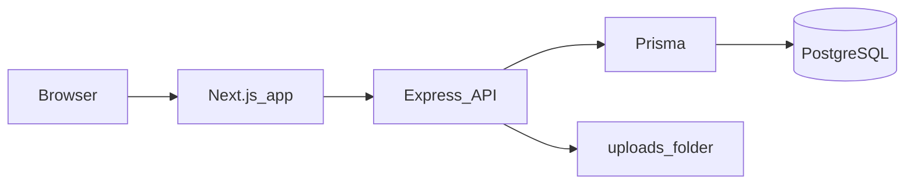

# Thinking Pixel IMS

**Thinking Pixel IMS** is a creative internal management system for digital atelier operations. It covers clients and jobs, creative tasks and asset versions, HR (attendance and leave), accounts and invoicing (with scheduled reminders), in-app notifications, leadership views, HOD approvals, token-based client job review, and audit logging. The canonical domain model lives in `backend/src/prisma/schema.prisma`.

## Architecture



## Repository layout

| Path | Description |
|------|-------------|
| [`frontend/`](frontend/) | Next.js 16 and React 19 App Router UI (`frontend/app/`). |
| [`backend/`](backend/) | Express 5 REST API, Prisma, PostgreSQL, static files under `/uploads`, and an invoice reminder scheduler on startup. |
| [`doc/`](doc/) | Supplementary documentation and assets. |

### Main frontend routes

`/`, `/login`, `/dashboard`, `/clients`, `/jobs`, `/hr`, `/creative`, `/accounts`, `/notifications`, `/leadership`, `/approvals/hod`, `/client-review/[token]`.

## Prerequisites

- **Node.js** 20 LTS or newer recommended.
- **PostgreSQL** reachable via the connection string you set in `DATABASE_URL` (see [`backend/.env.example`](backend/.env.example)).

## Environment variables

**Backend** — copy [`backend/.env.example`](backend/.env.example) to `backend/.env`:

- `DATABASE_URL` — PostgreSQL connection string.
- `JWT_SECRET` — secret used to sign JWTs for API authentication.
- `PORT` — API port (default `4000` if unset).

**Frontend** — copy [`frontend/.env.example`](frontend/.env.example) to `frontend/.env.local` (or `.env`):

- `NEXT_PUBLIC_API_BASE` — base URL for the API **including** the `/api` path, for example `http://localhost:4000/api`.

## Local setup and run

1. Create a PostgreSQL database and set `DATABASE_URL` in `backend/.env`.

2. Install backend dependencies, generate the Prisma client, and apply migrations:

   ```bash
   cd backend
   npm install
   npm run prisma:generate
   npm run prisma:migrate
   ```

3. **Optional:** seed demo data and users:

   ```bash
   npm run seed
   ```

4. Start the API (also starts the reminder scheduler):

   ```bash
   npm run dev
   ```

5. In another terminal, install and run the frontend:

   ```bash
   cd frontend
   npm install
   npm run dev
   ```

   Open the URL shown in the terminal (typically `http://localhost:3000`).

### Seeded demo accounts

After `npm run seed` in `backend`, you can sign in at `/login` with:

| Email | Password | Role |
|-------|----------|------|
| `admin@thinkingpixel.com` | `Admin@123` | ADMIN |
| `hod@thinkingpixel.com` | `Hod@123` | HOD |
| `staff@thinkingpixel.com` | `Staff@123` | STAFF |
| `client@thinkingpixel.com` | `Client@123` | CLIENT |

The frontend stores the JWT in `localStorage` as `tp_token` and user payload as `tp_user` after login.

## Backend API

- **Health:** `GET /health` — returns `{ ok: true, service: "thinking-pixel-backend" }`.
- **Mounted under `/api`:** `auth`, `clients`, `jobs`, `hr`, `creative`, `accounts`, `notifications`, `leadership`, `audit-logs` (see [`backend/src/index.js`](backend/src/index.js)).

Uploaded files are served from `/uploads` relative to the API origin.

## Scripts reference

| Location | Command | Purpose |
|----------|---------|---------|
| `backend` | `npm run dev` | Run the API. |
| `backend` | `npm run prisma:generate` | Generate Prisma Client (`schema` at `src/prisma/schema.prisma`). |
| `backend` | `npm run prisma:migrate` | Create/apply a dev migration. |
| `backend` | `npm run seed` | Seed database. |
| `frontend` | `npm run dev` | Next.js dev server. |
| `frontend` | `npm run build` | Production build. |
| `frontend` | `npm run start` | Start production server after build. |
| `frontend` | `npm run lint` | Run ESLint. |

## Authentication note

Login and registration use the backend JWT endpoints (`/api/auth/...`) and client-side storage as described above. The frontend `package.json` lists `next-auth` as a dependency; the current login flow does not wire NextAuth for session management.
